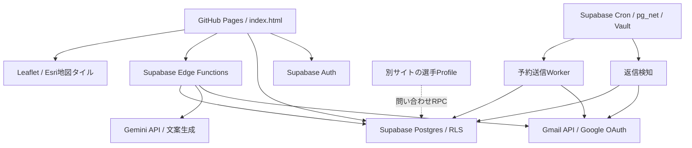

# 現行構成・コード整理記録

確認日: 2026-10-07（Asia/Tokyo）
対象: Akihiroの運用中システムのみ。汎用化案はこのリポジトリの外で管理する。
整理前の基準コミット: `a543f1560d3dca16c965bb7fb8dbb36258df09ce`。

## 1. 今回の整理

| 対象 | 判断・根拠 | 実施内容 |
| --- | --- | --- |
| `followup-batch-test.html` | 既存CRMの送信予約に移行済み。学校ごとに1件しか選べない旧仕様も残っていた | 削除 |
| `recruiting-gmail-followup-batch-test-send` | 別ページだけが利用する、CRMを更新しない即時テスト送信。直近24時間の2呼出は観測されたが、現行CRM・Cronからの参照はない | ソース・設定・デプロイ済み関数を削除 |
| `recruiting-gmail-followups` | 旧自動Follow-up。現行CRM・稼働中Cronに呼出元がなく、直近24時間の関数ログにも呼出がない。確認して予約する現在の経路に統一 | ソース・設定・デプロイ済み関数を削除 |
| `getEmailLinks` と表の未使用戻り値 | Gmail編集画面へ移行後、旧mailto文面を生成して破棄していた | 削除 |
| Base64/MIMEヘルパー4件・Gmailアカウント定数 | ブラウザ側から利用されず、送信はサーバーで実施 | 削除 |
| `staffFlag` / `mailButton` | 呼出元なし | 削除 |
| `renderInboundLeads` | 呼出元なし、描画先IDも存在しない。問い合わせ表示は現在のアクション一覧で行う | 削除。問い合わせ取込・紐付け処理は維持 |
| `outreachContactRole` | 呼出元なし | 削除 |
| `updateStatus` / `getStatusClass` | 旧学校ステータス操作。呼出元なし。現行表示は個別CRM・学校パイプラインを使用 | 削除 |
| `.npmrc` 6件 | コメントのみ。npm設定値なし | 削除 |
| `config.toml` の生成テンプレートコメント | 実際の設定に使われていない | 削除 |

直近24時間のログは廃止判断の補助であり、全期間・全外部利用者の不存在を証明するものではない。
利用中関数の認証・送信条件・本文生成ロジックは今回変更していない。

### 反映範囲

- 旧2関数のSupabase側削除は実施済み。残る12関数がACTIVEであることを一覧で確認。
- ソースとフロントの整理は保守ブランチでコミットする。main・GitHub Pagesへの反映はこの記録時点では未実施。
- 既存Test Mode、回帰テスト、適用済みMigrationは保持。
- DBのデータ削除・スキーマ変更・新規メール送信は行っていない。
- 今回の確認は参照検索、差分レビュー、HTML内JavaScriptの構文チェック、関数一覧・Cron・メタデータ・ログの読取。回帰テストと画面の実動作確認は今回未実施。

## 2. 現行の外部連携

| 連携先 | 用途 | 保守上の注意 |
| --- | --- | --- |
| GitHub Pages | 静的CRM画面の配信 | mainを配信。フロント変更はマージ後に公開される |
| Supabase Auth | 現行所有者のログイン | UIは固定所有者IDだけ許可。汎用ユーザー登録機能はない |
| Supabase DB / RLS | 選手、学校、CRM、履歴、予約 | 現行所有者単位で運用 |
| Google OAuth / Gmail API | 送信・スレッド読取・返信検知・ラベル | 現行はサーバー環境変数の単一Gmail認証 |
| Gemini API | 初回、Follow-up、個別返信の文案 | `GEMINI_API_KEY`。文案内容は送信前に利用者が確認 |
| Cron / pg_net / Vault | サーバー定期実行 | 返信検知10分、送信予約1分 |
| Leaflet 1.9.4 / Esri | 学校の地図表示 | Leafletはunpkg、タイルはEsri |
| jsDelivr / esm.sh / npm / jsr | クライアント・関数の依存取得 | Supabaseの一部参照はmajor指定。厳密なversion固定は今後の保守課題 |
| 公開Profile | 選手情報・問い合わせ窓口 | 別コード・同じDBへの依存があり得る。今回コード未調査 |
| YouTube / Instagram / 学校公式サイト | 動画・学校参照リンク | API接続ではなくリンク |

秘密値を記録しない。利用中の環境変数名: `SUPABASE_URL`、`SUPABASE_SERVICE_ROLE_KEY`、`GOOGLE_OAUTH_CLIENT_ID`、`GOOGLE_OAUTH_CLIENT_SECRET`、`GOOGLE_OAUTH_REFRESH_TOKEN`、`GMAIL_ACCOUNT`、`GEMINI_API_KEY`、`FOLLOWUP_BATCH_WORKER_SECRET`。返信検知などの個別認証設定は各エントリポイントを参照する。
旧関数専用の `RECRUITING_FOLLOWUP_SECRET` は現行ソースから参照されなくなった。秘密値は列挙せず、Vaultとの依存確認後に設定の廃止を判断する。

### 稼働中の12関数

| 関数 | 呼出元 / 役割 |
| --- | --- |
| `recruiting-ai-initial-draft` | CRM / 初回のResearch文案 |
| `recruiting-ai-followup-draft` | CRM / Follow-up文案 |
| `recruiting-ai-reply-draft` | 個別CRM / 返信文案 |
| `recruiting-gmail-initial-send` | Gmail編集画面 / 初回送信 |
| `recruiting-gmail-followup-send` | Gmail編集画面 / 個別通常Follow-up |
| `recruiting-gmail-reply-send` | 個別CRM / Coach返信への返信 |
| `recruiting-gmail-conversation-followup-send` | 個別CRM / 返信後の会話Follow-up |
| `recruiting-gmail-label-sync` | CRM保存 / Gmailラベル同期 |
| `recruiting-gmail-replies` | Cron / 返信検知とCRM更新 |
| `recruiting-gmail-followup-batch-prepare` | 送信予約 / 宛先・日時・スレッド確認 |
| `recruiting-gmail-followup-batch-schedule` | 送信予約 / 確認済み内容を予約 |
| `recruiting-gmail-followup-batch-worker` | Cron / 予約送信・ラベル再試行 |

### Cron

| jobid | 名前 | 頻度 | 実行先 |
| --- | --- | --- | --- |
| 1 | `recruiting-gmail-replies-every-10-min` | 10分ごと | `recruiting-gmail-replies` |
| 2 | `recruiting-followup-batch-test-worker` | 1分ごと | `recruiting-gmail-followup-batch-worker` |

job 2の名前は過去のTest導入時のものだが、現在はTestと本番の両予約を処理する。名前だけを理由に削除しない。旧 `x-recruiting-test-mode` ヘッダーはWorkerで未参照だが、稼働中ジョブ設定の変更は今回行わない。

## 3. DB資産の整理判断

| テーブル | 現行の用途 / 判断 |
| --- | --- |
| `player_profile` | 選手Master。公開Profileからの利用もあるため維持 |
| `recruiting_universities` | 学校・Coach Master。埋込fallbackも障害時に使うため維持 |
| `recruiting_program_research` | 出典付きResearch。AI文案で利用 |
| `recruiting_contacts` / `recruiting_contact_history` | Coach単位の状態と履歴。維持 |
| `recruiting_followup_batches` / `recruiting_followup_batch_items` | 予約・送信証跡。維持 |
| `recruiting_school_pipeline` | ID Camp / Offer段階。維持 |
| `recruiting_inbound_leads` | Profile問い合わせ。維持 |
| `recruiting_records` | お気に入り・旧学校ステータス。返信検知・画面の互換処理がまだ参照するため維持 |
| `coach_interactions` | 当リポジトリから参照なし。2件のデータあり。別Profileの依存未確認のため保留 |
| `recruiting_contacts_cleanup_backup_20260930` | 34件の復旧データ。RLSあり・policyなし。保存期限・復旧不要の確認後に別途廃止 |

適用済みMigrationは上書きや削除をしない。現在有効な予約RPCは最後のproduction予約Migrationに定義され、過去版は適用履歴として必要。

## 4. 次の保守で扱う事項

1. **共有Profileの依存確認**: `coach_interactions` の実利用を調べる。現行policyはPUBLICにALL・条件trueを許可しているため、廃止または受付APIへ限定する設計を優先して検討する。
2. **既存の警告整理**: security advisorにERRORなし。WARNとしてResearch RPCのsearch_path、publicのpg_net、呼出可能なSECURITY DEFINER、漏洩パスワード保護OFFを記録。問い合わせRPCは公開受付として意図的な設計、予約RPCは認証・所有者検証があるため、警告だけでアクセスを取り消さない。
3. **利用中Gmail処理の重複**: OAuth更新、MIME、API呼出が個別送信関数と共通ファイルに重複。次回は関数ごとに共通化し、認証エラー・送信不明・返信済みの実動作を確認してから反映する。
4. **AI依存の整理**: 3関数でモデル候補・API呼出・JSON解釈が重複。現在の文案品質を維持した共通化と、利用中モデルの実在・契約・料金確認を別保守として行う。
5. **長いHTMLの分割**: UI状態、CRM、Gmail編集、予約、地図を小さく分離する。今回の削除と同時には行わない。
6. **依存固定**: 現行の動作版を特定してversionとlockfileを管理する。単に最新へ更新しない。

警告の解説: [Supabase Database Linter](https://supabase.com/docs/guides/database/database-linter)、[パスワード保護](https://supabase.com/docs/guides/auth/password-security#password-strength-and-leaked-password-protection)。
2026-10-05の [Supabase adapters廃止案内](https://supabase.com/changelog/supabase-server-adapters-deprecated) はframework adaptersが対象。現在使う `withSupabase` 自体は廃止対象ではない。

## 5. 復旧

削除したソースは基準コミットから復元できる。必要になった場合は当該ファイルとconfigの該当エントリを復元し、プロジェクトrefを指定して再デプロイする。廃止した旧自動送信に新しいCronを追加しない。現行予約Workerと重複送信しないことを確認して復旧する。
